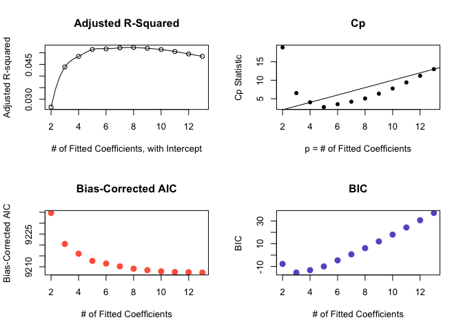

A Re-analysis of Mortality and Morbidity with Digoxin Use in Heart Failure Patients
================
Trish Campos
Version 2: 2017-06-16

Task 1: Data Source
===================

The data set was obtained by request from the National Heart, Lung and Blood Institute (NHLBI). In order to maintain anonymity, variables from the orginal dataset were permutated across observations. The original dataset was collected by the Digitalis Investigation Group from over 300 centers in the US and Canada for the purpose of investigating the effect of Digoxin dosage on hospitalization and mortality in patients with heart failure and normal sinus rhythm.

Task 2: Load and Tidy the Data
==============================

``` r
dig.data <- read.csv("dig.csv") %>% tbl_df

# select only females 80 or younger without stroke or diabetes
dig.data.subset <- dig.data %>% 
  filter(SEX == "2" & AGE <= "80" & DIABETES == "0" & STRK == "0" 
         & !is.na(CHFDUR) & !is.na(HEARTRTE) & !is.na(DIABP) & !is.na(FUNCTCLS)
         & !is.na(PREVMI))

# select only the variables needed
dig.data.subset <- select(dig.data.subset, recordID, TRTMT, AGE, 
                    RACE, EJF_PER, BMI, CHFDUR, NSYM, HEARTRTE, 
                    DIABP, SYSBP, FUNCTCLS, PREVMI, 
                    HYPERTEN, DIGDOSE, WHF, WHFDAYS,
                    DIG, DEATH, DEATHDAY)
```

Originally there were 6,800 observations. The chosen subset contains women under the age of 80 with no history of diabetes or stroke. I removed 7 observations with missing values in any of the variables. I also removed variables that I have no intention of using.

Task 3: Listing of My Tibble
============================

``` r
dig.data.subset
```

    # A tibble: 984 x 27
       recordID TRTMT   AGE  RACE EJF_PER    BMI CHFDUR  NSYM HEARTRTE DIABP
          <int> <int> <int> <int>   <int>  <dbl>  <int> <int>    <int> <int>
     1        3     0    72     1      36 25.530     12     4       91    70
     2        6     0    69     2      45 27.770     84     4       64    76
     3        7     1    64     1      30 31.694     31     1      102    90
     4       10     1    64     1      24 28.697     33     4      112    80
     5       13     0    66     1      42 32.802      1     4       72    78
     6       27     0    65     2      34 27.673     22     4       85    80
     7       31     1    74     1      30 24.691     84     2       81    70
     8       32     1    77     1      41 25.113     83     4       76    68
     9       41     0    71     2      34 24.314     24     4       88    60
    10       47     0    74     1      38 34.330     25     4       76    70
    # ... with 974 more rows, and 17 more variables: SYSBP <int>,
    #   FUNCTCLS <int>, PREVMI <int>, HYPERTEN <int>, DIGDOSE <dbl>,
    #   WHF <int>, WHFDAYS <int>, DIG <int>, DEATH <int>, DEATHDAY <int>,
    #   TRTMT.F <fctr>, PREVMI.F <fctr>, RACE.F <fctr>, HYPERTEN.F <fctr>,
    #   WHF.F <fctr>, DIG.F <fctr>, FUNCTCLS.F <fctr>

The data set contains 984 observations with 20 columns including the record ID.

\newpage

Task 4: Code Book
=================

    # A tibble: 21 x 3
       Variable         Type
          <chr>        <chr>
     1 recordID    Record ID
     2    TRTMT       Binary
     3      AGE Quantitative
     4     RACE       Binary
     5  EJF_PER Quantitative
     6      BMI Quantitative
     7   CHFDUR      Integer
     8     NSYM      Integer
     9 HEARTRTE Quantitative
    10    DIABP Quantitative
    # ... with 11 more rows, and 1 more variables: Notes <chr>

Task 5: My Subjects
===================

Patients with heart failure, normal sinus rhythm, and left ventricular ejection fractions of less than or equal to 0.45 were included in the trial. This subset of the data includes only women with no history of diabetes or stroke. The patients were taken from 300 centers in the United States and Canada between February 1991 and September 1993 with follow ups until December of 1995.

Task 6: My Variables
====================

-   `recordID`: Original Record ID for patients.
-   `TRMT`: Binary categorical variable indicating whether or not the patient got the digoxin treatment or not. A value of 0 indicates not treated.
-   `AGE`: Patient age in years at the time of randomization.
-   `RACE`: Patient race, either White (1) or Non-white (2).
-   `EJF_PER`: Patient Ejection Fraction expressed as a percentage. This gives a measure of how much blood leaves the heart with each contraction. Higher is better.
-   `BMI`: Body Mass Index, height to mass ratio used to indicate obesity.
-   `CHFDUR`: Congestive Heart Failure Duration, the number of months patient has been in congestive heart failure prior to randomization
-   `NSYM`: Number of Symptoms of Congestive Heart Failure, the sum of 8 possible symptoms including: Rales, Elevated Jugular Venous Pressure, Peripheral Edema, Dyspnea at rest, Dyspnea on exertion, Limitation of activity, S3, Radiologic evidence of congestion. If four or more symptoms were noted, the value was given a 4.
-   `HEARTRTE`: Patient heartrate in beats per minute prior to randomization.
-   `DIABP`: Patient diastolic blood pressure (mm Hg) prior to randomization.
-   `SYSBP`: Patient sytolic blood pressure (mm Hg) prior to randomization.
-   `FUNCTCLS`: New York Heart Association Functional Class. Categorical variable ranging from class I - IV that assesses patient's ability to perform physical activity. Higher class numbers indicate more severe physical limitations.
-   `PREVMI`: Previous myocardial infarction (1) or not (0).
-   `HYPERTEN`: Whether the patient has a history of hypertension (1) or not (0).
-   `DIURET`: Whether the patient is on non-potassium sparing diuretics (1) or not (0).
-   `DIGDOSE`: Prescribed dosage of digoxin in miligrams/day.
-   `WHF`: Worsening Heart Failure. If the patient was hospitalized, did the symptoms of heart failure increase?
-   `WHFDAYS`: Number of days since randomization until hospitalization for worsening heart failure.
-   `DIG`: Whether the patient exhibited digoxin toxicity (1) or not (0).
-   `DEATH`: Whether the patient died (1) or not (0).
-   `DEATHDAY`: Number of days since randomization until death or last contact date if alive.
-   *Any variable ending in `.F` denotes the corresponding factor variable*

\newpage

Task 7: My Planned Linear Regression Model
==========================================

The quantiative outcome for the linear regression model will be `WHFDAYS` or the days since randomization until hospitalization for worsening heart failure with the following predictors:

-   Age (quantiative)
-   NYHA Functional Class (multi-categorical)
-   Treatment
-   Prescribed Digoxin dosage
-   Race
-   Ejection Fraction
-   BMI
-   Congestive Heart Failure Duration
-   Number of Heart Failure Symptoms
-   Heart rate
-   Previous MI
-   Diagnosed Hypertension

Task 8: My Planned Logistic Regression Model
============================================

The binary outcome for the logistic regression model will be mortality with the following predictors:

-   Age (quantiative)
-   NYHA Functional Class (multi-categorical)
-   Treatment
-   Prescribed Digoxin dosage
-   Race
-   Ejection Fraction
-   BMI
-   Congestive Heart Failure Duration
-   Number of Heart Failure Symptoms
-   Heart rate
-   Previous MI
-   Diagnosed Hypertension

Task 9: Affirmation
===================

The data set meets all of the requirements specified in the project instructions. I am certain that it is completely appropriate for these data to be shared with anyone, without any conditions. There are no concerns about privacy or security.

Task 10: Linear Regression
==========================

Predict the number of days since randomization until hospitalization for worsening heart failure in patients on digoxin versus the control.

Outcome Distribution
--------------------

``` r
ggplot(dig.data.subset.training, aes(x = WHFDAYS)) +
  geom_histogram(fill = "hotpink", col = "white") +
  labs(title = "Untransformed Continuous Outcome",
       x = "Worsening Heart Failure Days",
       subtitle = "Days since randomization to Hospitalization for Worsening HF") +
  theme_classic()
```


The outcome clusters around 50 and again around 1300 days, giving a bimodal distribution. This could prove challening to fit a linear model. The data are reasonably symmetrical, however, so I will not transform.

``` r
plot(spearman2(WHFDAYS ~ AGE + FUNCTCLS + TRTMT.F + DIGDOSE + RACE.F + EJF_PER + BMI + CHFDUR + NSYM + HEARTRTE + PREVMI.F + HYPERTEN.F, 
                data = dig.data.subset))
```


The Spearman plot suggests that if a cubic spline will be used in the model, it should be fit to the ejection fraction percentage (continuous variable), perhaps with an interaction term including functional class.

Kitchen Sink
------------

``` r
# use all the variables with ordinary least squares
# include a cubic spline with interaction terms
dd <- datadist(dig.data.subset.training)
options(datadist = "dd")

model.ks <- ols(WHFDAYS ~ AGE + FUNCTCLS + TRTMT.F + DIGDOSE + RACE.F + rcs(EJF_PER,3) + BMI + CHFDUR + NSYM + HEARTRTE + PREVMI.F + HYPERTEN.F, 
                data = dig.data.subset.training, x = TRUE, y = TRUE)
model.ks
```

    Linear Regression Model
     
     ols(formula = WHFDAYS ~ AGE + FUNCTCLS + TRTMT.F + DIGDOSE + 
         RACE.F + rcs(EJF_PER, 3) + BMI + CHFDUR + NSYM + HEARTRTE + 
         PREVMI.F + HYPERTEN.F, data = dig.data.subset.training, x = TRUE, 
         y = TRUE)
     
                      Model Likelihood     Discrimination    
                         Ratio Test           Indexes        
     Obs       738    LR chi2     48.97    R2       0.064    
     sigma516.5181    d.f.           13    R2 adj   0.047    
     d.f.      724    Pr(> chi2) 0.0000    g      151.956    
     
     Residuals
     
          Min       1Q   Median       3Q      Max 
     -1146.23  -443.45    83.94   412.63  1179.47 
     
     
                      Coef      S.E.     t     Pr(>|t|)
     Intercept        1265.0856 284.8089  4.44 <0.0001 
     AGE                -3.2119   1.8237 -1.76 0.0786  
     FUNCTCLS         -131.1723  29.6707 -4.42 <0.0001 
     TRTMT.F=DIG        38.9697  38.2243  1.02 0.3083  
     DIGDOSE           213.0461 264.9100  0.80 0.4215  
     RACE.F=Non-White -175.8059  48.2123 -3.65 0.0003  
     EJF_PER             2.6748   5.1547  0.52 0.6040  
     EJF_PER'            2.6127   6.1917  0.42 0.6732  
     BMI                -1.8320   3.6590 -0.50 0.6167  
     CHFDUR             -0.6348   0.5147 -1.23 0.2179  
     NSYM              -16.7393  27.0333 -0.62 0.5360  
     HEARTRTE            1.7728   1.5602  1.14 0.2562  
     PREVMI.F=Yes      -17.9434  39.9525 -0.45 0.6535  
     HYPERTEN.F=Yes     29.0962  38.4111  0.76 0.4490  
     

``` r
rms::vif(model.ks)
```

                 AGE         FUNCTCLS      TRTMT.F=DIG          DIGDOSE 
            1.016157         1.063855         1.009358         1.011247 
    RACE.F=Non-White          EJF_PER         EJF_PER'              BMI 
            1.020382         5.822272         5.709028         1.021325 
              CHFDUR             NSYM         HEARTRTE     PREVMI.F=Yes 
            1.013138         1.011802         1.014537         1.022787 
      HYPERTEN.F=Yes 
            1.011665 

The variables NYHA functional class and race were signficant in this model. Age was significant to the 90% level. From this output, older patient age, higher functional class (more physical impairment), and non-white status were associated with a shorter timeframe to hospitalization. (Remember, we want *more* days until hospitalization for heart failure.) Interestingly, neither the treatment (digoxin) nor the dosage were significant in this model. Note the abysmal *R*<sup>2</sup> value of 0.064 and the *R*<sub>*a**d**j*</sub> of 0.047; perhaps the model is over-fitted.

The variance inflation factors are all very close to 1 (and certainly below 5, with the exception of the nonlinear terms); collinearity is not an issue here.

``` r
# plot the anova values of the variables
plot(anova(model.ks))
```


The anova plot suggests that only Functional Class and Race were significant at the 5% level, while Age and Ejection fraction were significant at the 10% level.

``` r
plot(summary(model.ks), main="")
```


The odds ratio plot for the kitchen sink model shows that `AGE`, `FUNCTCLS`, `EJF_PER` and `RACE.F` have significant effects on the outcome.

``` r
plot(nomogram(model.ks))
```


``` r
plot(calibrate(model.ks))
```


    n=738   Mean absolute error=35.706   Mean squared error=2031.191
    0.9 Quantile of absolute error=78.51

This calibration plot is quite nonlinear, suggesting that this model does not predict optimally in any regions.

Best Subsets
------------

``` r
# save the model predictors
predictors <- with(dig.data.subset.training, cbind(AGE, EJF_PER, 
                              BMI, CHFDUR, NSYM, HEARTRTE, 
                              FUNCTCLS, DIGDOSE, TRTMT.F, 
                              PREVMI.F, RACE.F, HYPERTEN.F))

x1 <- regsubsets(predictors, dig.data.subset.training$WHFDAYS, nvmax = 12)
rs <- summary(x1)
rs
```

    Subset selection object
    12 Variables  (and intercept)
               Forced in Forced out
    AGE            FALSE      FALSE
    EJF_PER        FALSE      FALSE
    BMI            FALSE      FALSE
    CHFDUR         FALSE      FALSE
    NSYM           FALSE      FALSE
    HEARTRTE       FALSE      FALSE
    FUNCTCLS       FALSE      FALSE
    DIGDOSE        FALSE      FALSE
    TRTMT.F        FALSE      FALSE
    PREVMI.F       FALSE      FALSE
    RACE.F         FALSE      FALSE
    HYPERTEN.F     FALSE      FALSE
    1 subsets of each size up to 12
    Selection Algorithm: exhaustive
              AGE EJF_PER BMI CHFDUR NSYM HEARTRTE FUNCTCLS DIGDOSE TRTMT.F
    1  ( 1 )  " " " "     " " " "    " "  " "      "*"      " "     " "    
    2  ( 1 )  " " " "     " " " "    " "  " "      "*"      " "     " "    
    3  ( 1 )  " " "*"     " " " "    " "  " "      "*"      " "     " "    
    4  ( 1 )  "*" "*"     " " " "    " "  " "      "*"      " "     " "    
    5  ( 1 )  "*" "*"     " " "*"    " "  " "      "*"      " "     " "    
    6  ( 1 )  "*" "*"     " " "*"    " "  "*"      "*"      " "     " "    
    7  ( 1 )  "*" "*"     " " "*"    " "  "*"      "*"      " "     "*"    
    8  ( 1 )  "*" "*"     " " "*"    " "  "*"      "*"      "*"     "*"    
    9  ( 1 )  "*" "*"     " " "*"    " "  "*"      "*"      "*"     "*"    
    10  ( 1 ) "*" "*"     " " "*"    "*"  "*"      "*"      "*"     "*"    
    11  ( 1 ) "*" "*"     "*" "*"    "*"  "*"      "*"      "*"     "*"    
    12  ( 1 ) "*" "*"     "*" "*"    "*"  "*"      "*"      "*"     "*"    
              PREVMI.F RACE.F HYPERTEN.F
    1  ( 1 )  " "      " "    " "       
    2  ( 1 )  " "      "*"    " "       
    3  ( 1 )  " "      "*"    " "       
    4  ( 1 )  " "      "*"    " "       
    5  ( 1 )  " "      "*"    " "       
    6  ( 1 )  " "      "*"    " "       
    7  ( 1 )  " "      "*"    " "       
    8  ( 1 )  " "      "*"    " "       
    9  ( 1 )  " "      "*"    "*"       
    10  ( 1 ) " "      "*"    "*"       
    11  ( 1 ) " "      "*"    "*"       
    12  ( 1 ) "*"      "*"    "*"       

Performing a best subsets approach shows that the NYHA functional class is in all models, with ejection fraction in all but two. The instance of a previous myocardial infarction is represented in only 1 out of the 12 models.

``` r
pander(t(temp))
```

<table style="width:100%;">
<colgroup>
<col width="15%" />
<col width="6%" />
<col width="7%" />
<col width="7%" />
<col width="6%" />
<col width="6%" />
<col width="6%" />
<col width="6%" />
<col width="6%" />
<col width="6%" />
<col width="6%" />
<col width="6%" />
<col width="6%" />
</colgroup>
<tbody>
<tr class="odd">
<td align="center"><strong>p</strong></td>
<td align="center">2</td>
<td align="center">3</td>
<td align="center">4</td>
<td align="center">5</td>
<td align="center">6</td>
<td align="center">7</td>
<td align="center">8</td>
<td align="center">9</td>
<td align="center">10</td>
<td align="center">11</td>
<td align="center">12</td>
<td align="center">13</td>
</tr>
<tr class="even">
<td align="center"><strong>Radj</strong></td>
<td align="center">0.027</td>
<td align="center">0.044</td>
<td align="center">0.048</td>
<td align="center">0.051</td>
<td align="center">0.052</td>
<td align="center">0.052</td>
<td align="center">0.052</td>
<td align="center">0.052</td>
<td align="center">0.051</td>
<td align="center">0.051</td>
<td align="center">0.05</td>
<td align="center">0.048</td>
</tr>
<tr class="odd">
<td align="center"><strong>bic</strong></td>
<td align="center">-7.72</td>
<td align="center">-15.34</td>
<td align="center">-13.24</td>
<td align="center">-9.96</td>
<td align="center">-4.59</td>
<td align="center">0.68</td>
<td align="center">6.14</td>
<td align="center">12.03</td>
<td align="center">18.03</td>
<td align="center">24.27</td>
<td align="center">30.67</td>
<td align="center">37.06</td>
</tr>
<tr class="even">
<td align="center"><strong>aic.cor</strong></td>
<td align="center">9235</td>
<td align="center">9220</td>
<td align="center">9216</td>
<td align="center">9213</td>
<td align="center">9212</td>
<td align="center">9210</td>
<td align="center">9209</td>
<td align="center">9208</td>
<td align="center">9208</td>
<td align="center">9208</td>
<td align="center">9207</td>
<td align="center">9207</td>
</tr>
<tr class="odd">
<td align="center"><strong>Cp</strong></td>
<td align="center">18.9</td>
<td align="center">6.5</td>
<td align="center">4</td>
<td align="center">2.7</td>
<td align="center">3.5</td>
<td align="center">4.2</td>
<td align="center">5.1</td>
<td align="center">6.4</td>
<td align="center">7.8</td>
<td align="center">9.4</td>
<td align="center">11.2</td>
<td align="center">13</td>
</tr>
<tr class="even">
<td align="center"><strong>dif</strong></td>
<td align="center">16.9</td>
<td align="center">3.5</td>
<td align="center">0</td>
<td align="center">-2.3</td>
<td align="center">-2.5</td>
<td align="center">-2.8</td>
<td align="center">-2.9</td>
<td align="center">-2.6</td>
<td align="center">-2.2</td>
<td align="center">-1.6</td>
<td align="center">-0.8</td>
<td align="center">0</td>
</tr>
</tbody>
</table>

Models with 6 - 9 predictors (including intercept) had the highest *R*<sub>*a**d**j*</sub> values, 0.052. Variables typically included were: Age, Ejection Fraction, Functional Class, and Digoxin Dose. Because we want to maximize *R*<sub>*a**d**j*</sub>, while minimizing the BIC, AIC, and *C*<sub>*p*</sub>, model 4 is looking pretty good. Model 4 includes the intercept, ejection fraction, functional class, and race. See the plot below.



By inspection, the *C*<sub>*p*</sub> statistic is best with 4 coefficients (intercept included), however the Adjusted R-squared doesn't level off until around 6 coefficients. Similarly the Bias-Corrected AIC is still quite large with 4. The BIC looks best with 3 coefficients, however it is only marginally better than the model with 4.

### Model Comparison

Compare 4 models based on best values for Cp, Corrected AIC, BIC, and Adjusted *R*<sup>2</sup>. The candidate models include:

    # A tibble: 4 x 3
          Summary Coefficients
            <chr>        <chr>
    1          Cp            4
    2    Corr AIC           12
    3         BIC            3
    4 Adjusted R2            6
    # ... with 1 more variables: Predictors <chr>

``` r
# models are named by adding 1 to the number of variables. 
lm1 <- lm(WHFDAYS ~ 1, data = dig.data.subset.training)
lm3 <- lm(WHFDAYS ~ FUNCTCLS + RACE.F, 
          data = dig.data.subset.training)
lm4 <- lm(WHFDAYS ~ FUNCTCLS + RACE.F + EJF_PER, 
          data = dig.data.subset.training)
lm6 <- lm(WHFDAYS ~ AGE + FUNCTCLS + RACE.F + CHFDUR + 
            EJF_PER, data = dig.data.subset.training)
lm12 <- lm(WHFDAYS ~ AGE + FUNCTCLS + TRTMT.F + DIGDOSE + RACE.F + 
              BMI + CHFDUR + NSYM + HEARTRTE + EJF_PER +
              HYPERTEN.F, data = dig.data.subset.training)

anova(lm12, lm6, lm4, lm3, lm1)
```

    Analysis of Variance Table

    Model 1: WHFDAYS ~ AGE + FUNCTCLS + TRTMT.F + DIGDOSE + RACE.F + BMI + 
        CHFDUR + NSYM + HEARTRTE + EJF_PER + HYPERTEN.F
    Model 2: WHFDAYS ~ AGE + FUNCTCLS + RACE.F + CHFDUR + EJF_PER
    Model 3: WHFDAYS ~ FUNCTCLS + RACE.F + EJF_PER
    Model 4: WHFDAYS ~ FUNCTCLS + RACE.F
    Model 5: WHFDAYS ~ 1
      Res.Df       RSS Df Sum of Sq       F   Pr(>F)    
    1    726 193259714                                  
    2    732 194406275 -6  -1146561  0.7179  0.63531    
    3    734 195610306 -2  -1204031  2.2615  0.10492    
    4    735 196806908 -1  -1196601  4.4952  0.03433 *  
    5    737 206408522 -2  -9601614 18.0347 2.27e-08 ***
    ---
    Signif. codes:  0 '***' 0.001 '**' 0.01 '*' 0.05 '.' 0.1 ' ' 1

This ANOVA comparison suggests that I use the model with 3 variables, including functional class, race, and the intercept. However, I will use the model with 4 variables as I am not constrained by degrees of freedom.

### Model Calibration

``` r
m4.ols <- ols(WHFDAYS ~ EJF_PER + FUNCTCLS + RACE.F, 
              data = dig.data.subset.training, x = TRUE, y = TRUE)
plot(calibrate(m4.ols))
```


    n=738   Mean absolute error=15.751   Mean squared error=630.8489
    0.9 Quantile of absolute error=36.814

The model in question: *W**H**F**D**A**Y**S* = *E**J**F* + *F**U**N**C**T**C**L**S* + *R**A**C**E*.*F*

This model could be worse. Specifically, values within 800 to around 1000 days are reasonably well described while values outside of this range are overpredicted. See coefficients in the table below.

<table style="width:64%;">
<caption>Model 4 Coefficients, 95% CI</caption>
<colgroup>
<col width="23%" />
<col width="9%" />
<col width="15%" />
<col width="15%" />
</colgroup>
<thead>
<tr class="header">
<th align="center">names</th>
<th align="center">x</th>
<th align="center">conf.low</th>
<th align="center">conf.high</th>
</tr>
</thead>
<tbody>
<tr class="odd">
<td align="center">Intercept</td>
<td align="center">1096</td>
<td align="center">883.3</td>
<td align="center">1308</td>
</tr>
<tr class="even">
<td align="center">EJF_PER</td>
<td align="center">4.63</td>
<td align="center">0.34</td>
<td align="center">8.93</td>
</tr>
<tr class="odd">
<td align="center">FUNCTCLS</td>
<td align="center">-127.3</td>
<td align="center">-185.2</td>
<td align="center">-69.46</td>
</tr>
<tr class="even">
<td align="center">RACE.F=Non-White</td>
<td align="center">-174.4</td>
<td align="center">-268.5</td>
<td align="center">-80.42</td>
</tr>
</tbody>
</table>

``` r
# plot nomogram for model 4
plot(nomogram(m4.ols))
```


Lasso
-----

Use the Lasso method to produce a model.

``` r
## Lasso Method
lassopreds <- with(dig.data.subset, cbind(AGE, EJF_PER, 
                              BMI, CHFDUR, NSYM, HEARTRTE, 
                              FUNCTCLS, DIGDOSE, TRTMT.F, 
                              PREVMI.F, RACE.F, HYPERTEN.F))

lasso1 <- lars(lassopreds, dig.data.subset$WHFDAYS, type="lasso")
plot(lasso1)
```


``` r
# plot the Mean Square Errors of to see where the fraction is minimized
set.seed(314159)
lassocv <- cv.lars(lassopreds, dig.data.subset$WHFDAYS, K=12)
```


``` r
# calculate the minimum L1 fraction
minL1 <- lassocv$index[which.min(lassocv$cv)]
minL1
```

    [1] 0.6161616

The mean squared error is minmized at 0.616. This suggests using a model with around 7 predictors - many more than model in 4.

``` r
# indentify the Lasso Coefficients
coef.cv <- coef(lasso1, s=minL1, mode="fraction")
Lasso1.nz <- round(coef.cv[c("AGE", "EJF_PER", "CHFDUR", "FUNCTCLS", "DIGDOSE", "TRTMT.F", "RACE.F")], 2)

# Compare the Non Zero coefficients

lm1 <- lm(WHFDAYS ~ AGE + EJF_PER + CHFDUR + FUNCTCLS + DIGDOSE + TRTMT.F + RACE.F, 
          data = dig.data.subset)
lm1.coef <- round(lm.beta(lm1),3)

pander(rbind(Lasso1.nz, lm1.coef), caption="Compare the Lasso and lm Coefficients")
```

<table style="width:100%;">
<caption>Compare the Lasso and lm Coefficients</caption>
<colgroup>
<col width="19%" />
<col width="8%" />
<col width="12%" />
<col width="10%" />
<col width="13%" />
<col width="12%" />
<col width="12%" />
<col width="12%" />
</colgroup>
<thead>
<tr class="header">
<th align="center"> </th>
<th align="center">AGE</th>
<th align="center">EJF_PER</th>
<th align="center">CHFDUR</th>
<th align="center">FUNCTCLS</th>
<th align="center">DIGDOSE</th>
<th align="center">TRTMT.F</th>
<th align="center">RACE.F</th>
</tr>
</thead>
<tbody>
<tr class="odd">
<td align="center"><strong>Lasso1.nz</strong></td>
<td align="center">-2.11</td>
<td align="center">4.96</td>
<td align="center">-0.06</td>
<td align="center">-135.3</td>
<td align="center">121.8</td>
<td align="center">2.49</td>
<td align="center">-76.02</td>
</tr>
<tr class="even">
<td align="center"><strong>lm1.coef</strong></td>
<td align="center">-0.063</td>
<td align="center">0.1</td>
<td align="center">-0.027</td>
<td align="center">-0.191</td>
<td align="center">0.04</td>
<td align="center">0.026</td>
<td align="center">-0.078</td>
</tr>
</tbody>
</table>

The lasso model suggests using the variables Age, Ejection Fraction, Functional Class, Digoxin Dose, Treatment, Race, and perhaps Heart Failure Duration. Ejection Fraction, Functional Class, and Race fit well with the best subsets model. The coefficients are quite different, suggesting that neither well predicts the model. There are no sign changes, however.

Generalize Model 4
------------------

### Compare the Training and Test Data

Although model 4 (`AGE`, `FUNCTCLS`, `RACE.F`) leaves a lot to be desired with an *R*<sup>2</sup> of 0.052, I will use it to see how well this model generalizes to my test data. Look at Mean Square Prediction Error and Mean Absolute Prediction Error.

<table style="width:69%;">
<colgroup>
<col width="26%" />
<col width="9%" />
<col width="11%" />
<col width="22%" />
</colgroup>
<thead>
<tr class="header">
<th align="center"> </th>
<th align="center">MAPE</th>
<th align="center">MSPE</th>
<th align="center">Max Abs. Error</th>
</tr>
</thead>
<tbody>
<tr class="odd">
<td align="center"><strong>Model 4</strong></td>
<td align="center">453.9</td>
<td align="center">278500</td>
<td align="center">1034</td>
</tr>
<tr class="even">
<td align="center"><strong>Lasso</strong></td>
<td align="center">807.1</td>
<td align="center">3256361</td>
<td align="center">1804</td>
</tr>
<tr class="odd">
<td align="center"><strong>Kitchen Sink</strong></td>
<td align="center">454.6</td>
<td align="center">280700</td>
<td align="center">1026</td>
</tr>
</tbody>
</table>

While none of these are particularly good, I still like Model 4 the best given that its mean absolute and mean square prediction errors are smallest. The max absolute errors are close enough in both model 4 and kitchen sink that the difference is negligible.

### Does Model 4 Generalize to the Whole Dataset?

I actually hope that this model doesn't generalize to the whole dataset as I chose a relatively healthy subset of patients (females under 80 with no history of stroke or diabetes).

``` r
# Use m4 with the entire dataset (n=6800)
m4.final <-  ols(WHFDAYS ~ EJF_PER + FUNCTCLS + RACE.F, 
              data = dig.data, x = TRUE, y = TRUE)

# Show coefficients with confidence interval
m4.final.confint <- round(confint_tidy(m4.final), 2)
pander(cbind(tidy(round(m4.final$coefficients, 2)), m4.final.confint), 
       caption = "Model 4 Generalized Coefficients, 95% CI")
```

<table style="width:64%;">
<caption>Model 4 Generalized Coefficients, 95% CI</caption>
<colgroup>
<col width="23%" />
<col width="9%" />
<col width="15%" />
<col width="15%" />
</colgroup>
<thead>
<tr class="header">
<th align="center">names</th>
<th align="center">x</th>
<th align="center">conf.low</th>
<th align="center">conf.high</th>
</tr>
</thead>
<tbody>
<tr class="odd">
<td align="center">Intercept</td>
<td align="center">939.6</td>
<td align="center">877.3</td>
<td align="center">1002</td>
</tr>
<tr class="even">
<td align="center">EJF_PER</td>
<td align="center">8.64</td>
<td align="center">7.25</td>
<td align="center">10.03</td>
</tr>
<tr class="odd">
<td align="center">FUNCTCLS</td>
<td align="center">-124.8</td>
<td align="center">-142.7</td>
<td align="center">-107</td>
</tr>
<tr class="even">
<td align="center">RACE.F=Non-White</td>
<td align="center">-92.52</td>
<td align="center">-126.9</td>
<td align="center">-58.15</td>
</tr>
</tbody>
</table>

For ease of comparison the coefficients from model 4 applied to both datasets are reproduced below:

    # A tibble: 2 x 5
                 Model        Intercept            EJF_PER           FUNCTCLS
                 <chr>            <chr>              <chr>              <chr>
    1 Model 4 Training 1096 [883, 1308]  4.63 [0.34, 8.93] -127 [-185, -69.5]
    2  Model 4 General  940 [877, 1002] 8.64 [7.25, 10.03]  -125 [-143, -107]
    # ... with 1 more variables: RACE.F <chr>

The coefficients are actually quite similar. `EJF_PER` and `RACE.F` show the greatest differences in the estimates, however their 95% CI still overlap.

``` r
m4.final
```

    Frequencies of Missing Values Due to Each Variable
     WHFDAYS  EJF_PER FUNCTCLS   RACE.F 
           0        0        6        0 

    Linear Regression Model
     
     ols(formula = WHFDAYS ~ EJF_PER + FUNCTCLS + RACE.F, data = dig.data, 
         x = TRUE, y = TRUE)
     
     
                      Model Likelihood     Discrimination    
                         Ratio Test           Indexes        
     Obs      6794    LR chi2    427.20    R2       0.061    
     sigma509.2601    d.f.            3    R2 adj   0.061    
     d.f.     6790    Pr(> chi2) 0.0000    g      147.153    
     
     Residuals
     
          Min       1Q   Median       3Q      Max 
     -1164.57  -463.98    75.44   424.57  1106.88 
     
     
                      Coef      S.E.    t      Pr(>|t|)
     Intercept         939.6516 31.8212  29.53 <0.0001 
     EJF_PER             8.6390  0.7101  12.17 <0.0001 
     FUNCTCLS         -124.8406  9.0886 -13.74 <0.0001 
     RACE.F=Non-White  -92.5152 17.5307  -5.28 <0.0001 
     

Model 4 actually fits the general dataset better than the dataset it was fit to with an *R*<sup>2</sup> of 0.061 as compared to 0.052 of the subsetted data. However, neither of these values is great, so this is likely an artifact of greater scatter in the larger dataset.

``` r
plot(calibrate(m4.final))
```


    n=6794   Mean absolute error=9.976   Mean squared error=180.8847
    0.9 Quantile of absolute error=17.034

The calibration plot fit to all of the data is more linear than that fit to the subset. The overall fit is quite good except for the region above 1050 days, where the model tends to overpredict.

Task 11: Logistic Regression
============================

Predict mortality on the basis of the same variables used in the linear regression model.

Spearman *ρ*<sup>2</sup>
------------------------

``` r
plot(spearman2(DEATH ~ AGE + FUNCTCLS + TRTMT.F + DIGDOSE + RACE.F + EJF_PER + BMI + CHFDUR + NSYM + HEARTRTE + PREVMI.F + HYPERTEN.F, data = dig.data.subset))
```


From the Spearman plot, NYHA Functional Class and Ejection Fraction look to be the most important predictors for Mortality. I will add a non-linear term to ejection fraction percentage and I will include the interaction term functional class.

Kitchen Sink: Model 1
---------------------

    Logistic Regression Model
     
     lrm(formula = DEATH ~ AGE + FUNCTCLS + TRTMT.F + DIGDOSE + RACE.F + 
         rcs(EJF_PER, 3) + BMI + CHFDUR + NSYM + HEARTRTE + PREVMI.F + 
         HYPERTEN.F, data = dig.data.subset, x = TRUE, y = TRUE)
     
                           Model Likelihood     Discrimination    Rank Discrim.    
                              Ratio Test           Indexes           Indexes       
     Obs           984    LR chi2      52.78    R2       0.073    C       0.646    
      0            666    d.f.            13    g        0.570    Dxy     0.291    
      1            318    Pr(> chi2) <0.0001    gr       1.768    gamma   0.293    
     max |deriv| 8e-11                          gp       0.121    tau-a   0.128    
                                                Brier    0.207                     
     
                      Coef    S.E.   Wald Z Pr(>|Z|)
     Intercept        -0.3035 0.9912 -0.31  0.7595  
     AGE               0.0023 0.0068  0.33  0.7406  
     FUNCTCLS          0.5036 0.1103  4.57  <0.0001 
     TRTMT.F=DIG       0.1873 0.1407  1.33  0.1832  
     DIGDOSE           0.5567 0.9508  0.59  0.5582  
     RACE.F=Non-White -0.1455 0.1823 -0.80  0.4248  
     EJF_PER          -0.0558 0.0183 -3.05  0.0023  
     EJF_PER'          0.0392 0.0243  1.61  0.1064  
     BMI               0.0038 0.0137  0.28  0.7795  
     CHFDUR           -0.0003 0.0019 -0.14  0.8892  
     NSYM             -0.0058 0.0959 -0.06  0.9517  
     HEARTRTE         -0.0083 0.0057 -1.45  0.1474  
     PREVMI.F=Yes      0.0680 0.1468  0.46  0.6431  
     HYPERTEN.F=Yes   -0.0904 0.1413 -0.64  0.5220  
     

This model includes the same predictors as in the linear regression. In this case we are predicting mortality. The C statistic is low, at 0.646. The *R*<sup>2</sup> is also very low, 0.073. Of note, only Functional Class and Ejection Fraction are significant. This is not unexpected, as these two variables were also found in the linear regression model. As expected, higher ejection fractions seem to be associated with a lower probability of mortality while the higher functional class (most physical impairment) is associated with greater probabilities of mortality.


Again, functional class and ejection fraction are most important here. However, the anova plot suggests that Heart Rate may also be important in the model.

### Coefficient Table: Model 1

<table style="width:72%;">
<caption>Odds Ratios: Model 1</caption>
<colgroup>
<col width="23%" />
<col width="12%" />
<col width="18%" />
<col width="18%" />
</colgroup>
<thead>
<tr class="header">
<th align="center"> </th>
<th align="center">Effect</th>
<th align="center">Lower.0.95</th>
<th align="center">Upper.0.95</th>
</tr>
</thead>
<tbody>
<tr class="odd">
<td align="center"><strong>AGE</strong></td>
<td align="center">1.03</td>
<td align="center">0.8653</td>
<td align="center">1.226</td>
</tr>
<tr class="even">
<td align="center"><strong>FUNCTCLS</strong></td>
<td align="center">1.655</td>
<td align="center">1.333</td>
<td align="center">2.054</td>
</tr>
<tr class="odd">
<td align="center"><strong>DIGDOSE</strong></td>
<td align="center">1.321</td>
<td align="center">0.5203</td>
<td align="center">3.354</td>
</tr>
<tr class="even">
<td align="center"><strong>EJF_PER</strong></td>
<td align="center">0.6909</td>
<td align="center">0.5533</td>
<td align="center">0.8627</td>
</tr>
<tr class="odd">
<td align="center"><strong>BMI</strong></td>
<td align="center">1.022</td>
<td align="center">0.8776</td>
<td align="center">1.19</td>
</tr>
<tr class="even">
<td align="center"><strong>CHFDUR</strong></td>
<td align="center">0.9906</td>
<td align="center">0.8669</td>
<td align="center">1.132</td>
</tr>
<tr class="odd">
<td align="center"><strong>NSYM</strong></td>
<td align="center">0.977</td>
<td align="center">0.4608</td>
<td align="center">2.072</td>
</tr>
<tr class="even">
<td align="center"><strong>HEARTRTE</strong></td>
<td align="center">0.8616</td>
<td align="center">0.7043</td>
<td align="center">1.054</td>
</tr>
<tr class="odd">
<td align="center"><strong>TRTMT.F</strong></td>
<td align="center">1.206</td>
<td align="center">0.9153</td>
<td align="center">1.589</td>
</tr>
<tr class="even">
<td align="center"><strong>RACE.F</strong></td>
<td align="center">0.8646</td>
<td align="center">0.6048</td>
<td align="center">1.236</td>
</tr>
<tr class="odd">
<td align="center"><strong>PREVMI.F</strong></td>
<td align="center">0.9343</td>
<td align="center">0.7007</td>
<td align="center">1.246</td>
</tr>
<tr class="even">
<td align="center"><strong>HYPERTEN.F</strong></td>
<td align="center">0.9135</td>
<td align="center">0.6926</td>
<td align="center">1.205</td>
</tr>
</tbody>
</table>

From the exponentiated coefficient table, there are significant effects from elevated Functional Class (1.67 times as likely) and higher ejection fraction (0.66 times as likely). Neither treatment nor digoxin dose had significant effects on mortality.

### Calibration Plot: Model 1


    n=984   Mean absolute error=0.019   Mean squared error=0.00075
    0.9 Quantile of absolute error=0.04

The model 1 calibration plot is quite nonlinear, suggesting that while the model predicts reasonably well at low probabilities, values above 0.4 are overpredicted.

### Plot Predictions: Model 1

``` r
ggplot(Predict(lrm.model.1, EJF_PER = 0:45, FUNCTCLS, TRTMT.F, fun=plogis)) +
    theme_bw() +
  
    labs(x = "Ejection Fraction Percentage",
         y = "Pr(Death)",
         title = "Model 1 Predictions",
         subtitle = "Across Treatment Groups and Functional Class, holding all other predictors at their medians")
```


Plotting the probability of mortality predictions from Model 1 shows that Functional Class had a significant effect on the probability of mortality within the study period. Digoxin use was also associated with a higher risk of mortality, however the confidence intervals are overlapping and lack significance. Note the limitations of the model: an ejection fraction of 0 should give a mortality of 1 and we do not see that here.

### Nomogram: Model 1

``` r
plot(nomogram(lrm.model.1, fun=plogis, funlabel = "Probability of Mortality"))
```


Model 1 Validation
------------------

``` r
# Use Backwards elimination to validate 
set.seed(314159)
validate(lrm.model.1, bw=TRUE, B=10)
```


            Backwards Step-down - Original Model

     Deleted    Chi-Sq d.f. P      Residual d.f. P      AIC   
     NSYM        0.00  1    0.9517  0.00     1   0.9517  -2.00
     CHFDUR      0.02  1    0.8906  0.02     2   0.9888  -3.98
     BMI         0.08  1    0.7810  0.10     3   0.9919  -5.90
     AGE         0.11  1    0.7377  0.21     4   0.9948  -7.79
     PREVMI.F    0.21  1    0.6468  0.42     5   0.9947  -9.58
     DIGDOSE     0.33  1    0.5678  0.75     6   0.9934 -11.25
     HYPERTEN.F  0.38  1    0.5364  1.13     7   0.9924 -12.87
     RACE.F      0.73  1    0.3942  1.86     8   0.9851 -14.14
     TRTMT.F     1.75  1    0.1853  3.61     9   0.9351 -14.39
     HEARTRTE    1.89  1    0.1691  5.50    10   0.8552 -14.50
     EJF_PER    15.76  2    0.0004 21.26    12   0.0467  -2.74

    Approximate Estimates after Deleting Factors

                 Coef   S.E. Wald Z         P
    Intercept -2.1111 0.2733 -7.726 1.110e-14
    FUNCTCLS   0.5769 0.1083  5.327 1.001e-07

    Factors in Final Model

    [1] FUNCTCLS

              index.orig training    test optimism index.corrected  n
    Dxy           0.2008   0.2326  0.2131   0.0195          0.1813 10
    R2            0.0438   0.0591  0.0494   0.0097          0.0341 10
    Intercept     0.0000   0.0000 -0.0856   0.0856         -0.0856 10
    Slope         1.0000   1.0000  0.9217   0.0783          0.9217 10
    Emax          0.0000   0.0000  0.0335   0.0335          0.0335 10
    D             0.0308   0.0421  0.0351   0.0070          0.0238 10
    U            -0.0020  -0.0020  0.0005  -0.0025          0.0005 10
    Q             0.0329   0.0441  0.0346   0.0095          0.0233 10
    B             0.2116   0.2067  0.2112  -0.0046          0.2162 10
    g             0.4038   0.4694  0.4261   0.0433          0.3605 10
    gp            0.0857   0.0986  0.0914   0.0071          0.0785 10

    Factors Retained in Backwards Elimination

     AGE FUNCTCLS TRTMT.F DIGDOSE RACE.F EJF_PER BMI CHFDUR NSYM HEARTRTE
         *                                                               
         *                               *                               
         *                               *                               
         *                                                               
         *                               *                               
     *   *                               *                               
                                         *                               
         *                               *                               
                                                                         
         *                               *                               
     PREVMI.F HYPERTEN.F
                        
                        
                        
                        
                        
                        
                        
                        
                        
                        

    Frequencies of Numbers of Factors Retained

    0 1 2 3 
    1 3 5 1 

The backwards elimination model validation suggested retaining Functional Class and Ejection Fraction Percentage. Age was retained in one of the cases.

### Calculating the C Statistic

$$
C = 0.5 + \\frac{D\_{xy}}{2} = 0.5 + \\frac{0.181}{2} = 0.591
$$

This C statistic is terrible, predicting mortality only slightly better than random chance. Compare this to the value obtained earlier of 0.646. The search for a better model begins!

Model 2
-------

Create a new model incorporating `HEARTRTE`, `FUNCTCLS`, and `EJF_PER`. I opted to include `HEARTRTE` instead of `AGE` despite the backwards validation results as `HEARTRTE` was almost significant via the anova plot from Model 1.

``` r
dd <- datadist(dig.data.subset)
options(datadist = "dd")

model.2 <- lrm(DEATH ~ rcs(EJF_PER, 3)*FUNCTCLS + HEARTRTE,
               data = dig.data.subset, x = T, y = T)
model.2
```

    Logistic Regression Model
     
     lrm(formula = DEATH ~ rcs(EJF_PER, 3) * FUNCTCLS + HEARTRTE, 
         data = dig.data.subset, x = T, y = T)
     
                           Model Likelihood     Discrimination    Rank Discrim.    
                              Ratio Test           Indexes           Indexes       
     Obs           984    LR chi2      51.10    R2       0.071    C       0.639    
      0            666    d.f.             6    g        0.574    Dxy     0.277    
      1            318    Pr(> chi2) <0.0001    gr       1.775    gamma   0.280    
     max |deriv| 5e-09                          gp       0.120    tau-a   0.122    
                                                Brier    0.207                     
     
                         Coef    S.E.   Wald Z Pr(>|Z|)
     Intercept            2.0696 1.7481  1.18  0.2365  
     EJF_PER             -0.1363 0.0736 -1.85  0.0639  
     EJF_PER'             0.1035 0.0959  1.08  0.2802  
     FUNCTCLS            -0.2693 0.6355 -0.42  0.6718  
     HEARTRTE            -0.0080 0.0057 -1.41  0.1600  
     EJF_PER * FUNCTCLS   0.0317 0.0280  1.13  0.2578  
     EJF_PER' * FUNCTCLS -0.0249 0.0377 -0.66  0.5090  
     

The model is quite terrible with an *R*<sup>2</sup> of 0.071 and a C statistic of 0.639. Only `EJF_PER` appears significant to the 10 percent level.

### Anova Plot: Model 2

``` r
plot(anova(model.2))
```


Here Functional Class and Ejection Fraction Percentage appear significant.

### Coefficient Table: Model 2

<table style="width:69%;">
<caption>Odds Ratios: Model 2</caption>
<colgroup>
<col width="20%" />
<col width="12%" />
<col width="18%" />
<col width="18%" />
</colgroup>
<thead>
<tr class="header">
<th align="center"> </th>
<th align="center">Effect</th>
<th align="center">Lower.0.95</th>
<th align="center">Upper.0.95</th>
</tr>
</thead>
<tbody>
<tr class="odd">
<td align="center"><strong>EJF_PER</strong></td>
<td align="center">0.6324</td>
<td align="center">0.4843</td>
<td align="center">0.8257</td>
</tr>
<tr class="even">
<td align="center"><strong>FUNCTCLS</strong></td>
<td align="center">1.832</td>
<td align="center">1.32</td>
<td align="center">2.543</td>
</tr>
<tr class="odd">
<td align="center"><strong>HEARTRTE</strong></td>
<td align="center">0.8665</td>
<td align="center">0.7095</td>
<td align="center">1.058</td>
</tr>
</tbody>
</table>

The table above lists the exponentiated coefficients from model 2. Having a higher ejection fraction is associated with a lower mortality (0.63 times as likely). Patients with higher functional classes (more physical impairment) were 1.8 times as likely to die. Higher heart rates were associated with lower mortality (0.87 times as likely.)

### Calibration Plot: Model 2


    n=984   Mean absolute error=0.009   Mean squared error=0.00021
    0.9 Quantile of absolute error=0.015

This model is an improvement over the kitchen sink model. While probabilities under 0.2 tend to be underpredicted, the remainder of the data is fit reasonably well.

### Plot Predictions: Model 2

``` r
# Use model 2 to predict mortality 
ggplot(Predict(model.2, EJF_PER = 0:45, FUNCTCLS, fun=plogis)) +
    theme_bw() +
    labs(x = "Ejection Fraction Percentage",
         y = "Pr(Death)",
         title = "Model 2 Predictions",
         subtitle = "Across Functional Class, holding Heart Rate at 80 BPM")
```


This plot is interesting:

-   Above ejection fractions of about 8% the probability of mortality is increased in higher functional classes.
-   The mortality for patients in Functional Class IV is relatively insensitive to ejection fraction.
-   Patients in Functional Class I benefit the most with increased ejection fraction
-   This whole trend reverses at values below EFs of 8%. This is probably an artifact of the model used. This gives me serious reservations about this model.

### Nomogram: Model 2


The nomogram suggests that higher heartrates are associated with a lower probability of mortality. Higher ejection fractions were also associated with lower mortality, especially at lower functional classes.

Generalize Model 1
------------------

Although neither of these models were great, I will apply the larger subset of the data to model 1, because this dataset is much larger and will likely be harder to overfit. I also suspect that the graphical predictions from Model 2 don't make physical sense.

    Frequencies of Missing Values Due to Each Variable
         DEATH        AGE   FUNCTCLS    TRTMT.F    DIGDOSE     RACE.F 
             0          0          6          0          1          0 
       EJF_PER        BMI     CHFDUR       NSYM   HEARTRTE   PREVMI.F 
             0          1         14          0          8          1 
    HYPERTEN.F 
             1 

    Logistic Regression Model
     
     lrm(formula = DEATH ~ AGE + FUNCTCLS + TRTMT.F + DIGDOSE + RACE.F + 
         rcs(EJF_PER, 3) + BMI + CHFDUR + NSYM + HEARTRTE + PREVMI.F + 
         HYPERTEN.F, data = dig.data, x = TRUE, y = TRUE)
     
     
                           Model Likelihood     Discrimination    Rank Discrim.    
                              Ratio Test           Indexes           Indexes       
     Obs          6768    LR chi2     375.70    R2       0.074    C       0.640    
      0           4403    d.f.            13    g        0.576    Dxy     0.280    
      1           2365    Pr(> chi2) <0.0001    gr       1.778    gamma   0.281    
     max |deriv| 2e-09                          gp       0.126    tau-a   0.127    
                                                Brier    0.215                     
     
                      Coef    S.E.   Wald Z Pr(>|Z|)
     Intercept        -0.4127 0.3586 -1.15  0.2498  
     AGE              -0.0016 0.0024 -0.65  0.5137  
     FUNCTCLS          0.4716 0.0393 12.01  <0.0001 
     TRTMT.F=DIG      -0.0092 0.0525 -0.17  0.8614  
     DIGDOSE           0.4994 0.3628  1.38  0.1687  
     RACE.F=Non-White -0.0639 0.0747 -0.85  0.3927  
     EJF_PER          -0.0441 0.0068 -6.47  <0.0001 
     EJF_PER'          0.0088 0.0084  1.04  0.2970  
     BMI              -0.0044 0.0051 -0.86  0.3887  
     CHFDUR           -0.0001 0.0007 -0.19  0.8456  
     NSYM              0.0214 0.0333  0.64  0.5197  
     HEARTRTE         -0.0010 0.0021 -0.47  0.6396  
     PREVMI.F=Yes      0.0378 0.0551  0.69  0.4928  
     HYPERTEN.F=Yes    0.0041 0.0527  0.08  0.9378  
     

The *R*<sup>2</sup> statistic (0.074) is marginally better while the C statistic (0.64) is slightly worse. Again, Ejection Fraction and Functional Class appear to be the most important predictors.

### Coefficient Table: Generalized Model 1

<table style="width:72%;">
<caption>Odds Ratios: Generalized Model 1</caption>
<colgroup>
<col width="23%" />
<col width="12%" />
<col width="18%" />
<col width="18%" />
</colgroup>
<thead>
<tr class="header">
<th align="center"> </th>
<th align="center">Effect</th>
<th align="center">Lower.0.95</th>
<th align="center">Upper.0.95</th>
</tr>
</thead>
<tbody>
<tr class="odd">
<td align="center"><strong>AGE</strong></td>
<td align="center">0.9783</td>
<td align="center">0.916</td>
<td align="center">1.045</td>
</tr>
<tr class="even">
<td align="center"><strong>FUNCTCLS</strong></td>
<td align="center">1.602</td>
<td align="center">1.484</td>
<td align="center">1.731</td>
</tr>
<tr class="odd">
<td align="center"><strong>DIGDOSE</strong></td>
<td align="center">1.284</td>
<td align="center">0.8996</td>
<td align="center">1.832</td>
</tr>
<tr class="even">
<td align="center"><strong>EJF_PER</strong></td>
<td align="center">0.6153</td>
<td align="center">0.5693</td>
<td align="center">0.6651</td>
</tr>
<tr class="odd">
<td align="center"><strong>BMI</strong></td>
<td align="center">0.9736</td>
<td align="center">0.9161</td>
<td align="center">1.035</td>
</tr>
<tr class="even">
<td align="center"><strong>CHFDUR</strong></td>
<td align="center">0.9949</td>
<td align="center">0.9451</td>
<td align="center">1.047</td>
</tr>
<tr class="odd">
<td align="center"><strong>NSYM</strong></td>
<td align="center">1.089</td>
<td align="center">0.8393</td>
<td align="center">1.414</td>
</tr>
<tr class="even">
<td align="center"><strong>HEARTRTE</strong></td>
<td align="center">0.9827</td>
<td align="center">0.9133</td>
<td align="center">1.057</td>
</tr>
<tr class="odd">
<td align="center"><strong>TRTMT.F</strong></td>
<td align="center">0.9909</td>
<td align="center">0.894</td>
<td align="center">1.098</td>
</tr>
<tr class="even">
<td align="center"><strong>RACE.F</strong></td>
<td align="center">0.9381</td>
<td align="center">0.8103</td>
<td align="center">1.086</td>
</tr>
<tr class="odd">
<td align="center"><strong>PREVMI.F</strong></td>
<td align="center">0.9629</td>
<td align="center">0.8644</td>
<td align="center">1.073</td>
</tr>
<tr class="even">
<td align="center"><strong>HYPERTEN.F</strong></td>
<td align="center">1.004</td>
<td align="center">0.9056</td>
<td align="center">1.113</td>
</tr>
</tbody>
</table>

These coefficients are actually quite similar to what was obtained earlier with the subsetted data; all of the confidence intervals overlap.

### Calibration Plot: Generalized Model 1


    n=6768   Mean absolute error=0.006   Mean squared error=7e-05
    0.9 Quantile of absolute error=0.013

The calibration plot is much more linear, however we have a lot more data. The model appears to predict reaonsably well at all probabilities.

### Plot Predictions: Generalized Model 1

``` r
ggplot(Predict(lrm.model.1.final, EJF_PER = 0:45, FUNCTCLS, TRTMT.F, fun=plogis)) +
    theme_bw() +
  
    labs(x = "Ejection Fraction Percentage",
         y = "Pr(Death)",
         title = "Model 1 Predictions",
         subtitle = "Across Treatment Groups and Functional Class, holding all other predictors at their medians")
```


This plot is more inline with what I would have expected; patients in higher functional classes have a higher probability of mortality at all ejection fractions. However, the plotted predictions appear more linear than exponential. Of note, there appears to be a significant difference between the Digoxin and the Placebo groups; this was not evident in the subsetted data.

### Summary Table

    # A tibble: 3 x 3
            Model     C    R2
            <chr> <chr> <chr>
    1     Model 1 0.646 0.073
    2     Model 2 0.639 0.071
    3 Gen Model 1 0.640 0.074

Task 12: Questions
==================

-   **Linear Regression**: Any techniques specifically designed to deal with a bimodal outcome? Or does it not matter?
-   **Logistic Regression**: Any methods for presenting the coefficient variables/odds ratios in a more compact format?
